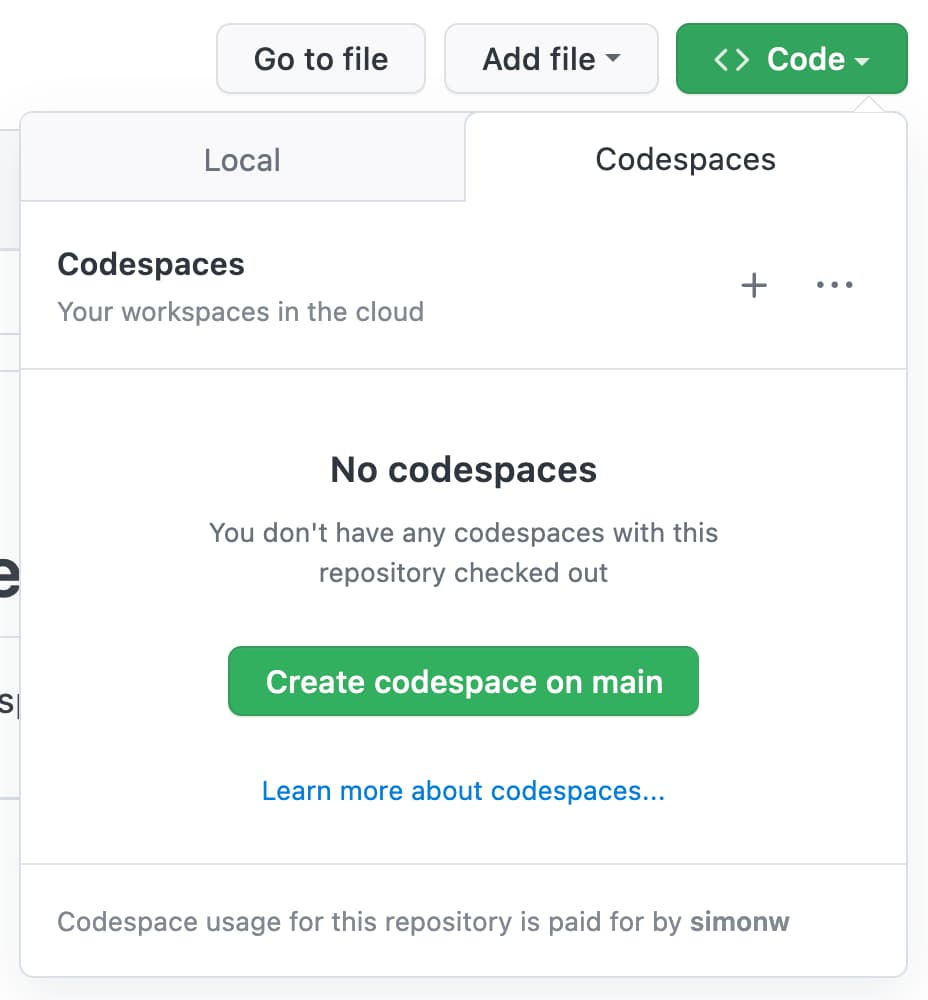

# codespaces-datasette

An example repository for running [Datasette](https://datasette.io/) in [GitHub Codespaces](https://github.com/features/codespaces).

Click the "Code" button and then "Codespaces" and "Create codespace on main" to get started.

